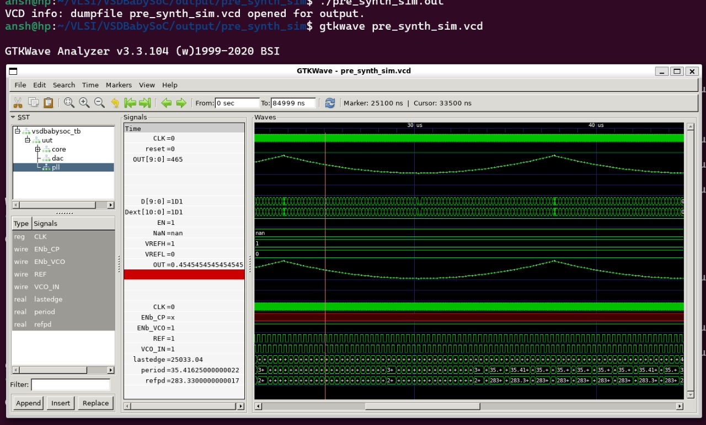

## Overview
The **VSDBabySoC** is a simple SoC (System-on-Chip) design incorporating a RISC-V processor (`rvmyth`), a PLL (Phase-Locked Loop) module (`pll`), and a DAC (Digital-to-Analog Converter) module (`dac`). This project demonstrates integration of these IP cores and aims to simulate and verify the design behavior using pre-synthesis and post-synthesis simulations.

## Project Structure
- `src/include/` - Contains header files (`*.vh`) with necessary macros or parameter definitions.
- `src/module/` - Contains Verilog files for each module in the SoC design.
- `output/` - Directory where compiled outputs and simulation files will be generated.

## 📂 Project Structure

```txt
VSDBabySoC/
├── src/
│   ├── include/      # Header files (*.vh)
│   ├── module/       # Verilog + TLV modules
│   │   ├── vsdbabysoc.v   # Top-level module
│   │   ├── rvmyth.v       # CPU
│   │   ├── avsdpll.v      # PLL
│   │   ├── avsddac.v      # DAC
│   │   └── testbench.v    # Testbench
└── output/           # Simulation outputs
```

### Module Descriptions

<details>
   <summary><strong>2.1 vsdbabysoc.v (Top-Level SoC Module)</strong></summary>
      This is the top-level module that integrates the rvmyth, pll, and dac modules.<br>
   [VSDBabySoC](https://github.com/manili/VSDBabySoC.git)
      
   
      - Inputs:
         - reset: Resets the core processor.
         - VCO_IN, ENb_CP, ENb_VCO, REF: PLL control signals.
         - VREFH: DAC reference voltage.
      - Outputs:
         - OUT: Analog output from DAC.
         - Connections:
         - RV_TO_DAC - A 10-bit bus that connects the RISC-V core output to the DAC input.
         - CLK - The clock signal generated by the PLL.
      
</details>

   <details>
     <summary><strong>2.2 rvmyth.v (RISC-V Core)</strong></summary>
     The rvmyth module is a simple RISC-V based processor. It outputs a 10-bit digital signal (OUT) to be converted by the DAC.<br>
     [rvmyth](https://github.com/kunalg123/rvmyth/)
      
      Inputs:
         - CLK: Clock signal generated by the PLL.
         - reset: Initializes or resets the processor.
      Outputs:
         - OUT: A 10-bit digital signal representing processed data to be sent to the DAC.
         
   </details>

   <details>
     <summary><strong>2.3 avsdpll.v (PLL Module)</strong></summary>
     The pll module is a phase-locked loop that generates a stable clock (CLK) for the RISC-V core.<br>
     [Introduction](https://github.com/ireneann713/PLL.git)
     [avsdpll](https://github.com/lakshmi-sathi/avsdpll_1v8.git)
      
      Inputs:
         - VCO_IN, ENb_CP, ENb_VCO, REF: Control and reference signals for PLL operation.
      Output:
         - CLK: A stable clock signal for synchronizing the core and other modules.
         
         
   </details>

   <details>
     <summary><strong>2.4 avsddac.v (DAC Module)</strong></summary>
     The dac module converts the 10-bit digital signal from the rvmyth core to an analog output.<br>
     [avsddac](https://github.com/vsdip/rvmyth_avsddac_interface.git)
      
      Inputs:
         - D: A 10-bit digital input from the processor.
         - VREFH: Reference voltage for the DAC.
      Output:
         - OUT: Analog output signal.

         
   </details>

### Testbench
The testbench.v file is a test module to verify the functionality of vsdbabysoc. It includes signal initialization, clock generation, and waveform dumping for both pre-synthesis and post-synthesis simulations.
Waveform Output:
   - pre_synth_sim.vcd or post_synth_sim.vcd files generated based on simulation conditions.

## Setting up

### Clone the VSDBabySoC Project 

```bash
cd ~/VLSI
git clone https://github.com/manili/VSDBabySoC.git
cd VSDBabySoC/
```

Hopefully you will see : 

* `src/` (modules)
* `images/` 


---

## 🔧 TLV → Verilog Conversion

Since **RVMYTH** is written in **TL-Verilog (.tlv)**, we need to convert it to Verilog before simulating.

```bash
# Install tools
sudo apt update
sudo apt install python3-venv python3-pip

# Create virtual env
python3 -m venv sp_env
source sp_env/bin/activate

# Install SandPiper-SaaS
pip install pyyaml click sandpiper-saas

# Convert TLV → Verilog
sandpiper-saas -i ./src/module/*.tlv -o rvmyth.v --bestsv --noline -p verilog --outdir ./src/module/
```

✅ Now you’ll have `rvmyth.v` alongside your other Verilog files.

---

## Simulation Flow

### Pre-Synthesis Simulation

```bash
mkdir -p output/pre_synth_sim

iverilog -o output/pre_synth_sim/pre_synth_sim.out \
  -DPRE_SYNTH_SIM \
  -I src/include -I src/module \
  src/module/testbench.v

cd output/pre_synth_sim
./pre_synth_sim.out
```
**Explanation:**
   - -DPRE_SYNTH_SIM: Defines the PRE_SYNTH_SIM macro for conditional compilation in the testbench.
   - The resulting pre_synth_sim.vcd file can be viewed in GTKWave.
Viewing in GTKWave:

```bash
gtkwave output/pre_synth_sim/pre_synth_sim.vcd
```

### Signals to Observe

*  **CLK** → Input clock (from PLL)
*  **reset** → Reset signal
*  **OUT (DAC)** → Output from DAC (appears digital in sim)
*  **RV_TO_DAC[9:0]** → 10-bit RVMYTH output → DAC input

---
### The Instruction Program Driving BabySoC  

1. Increment counters,
2. Accumulate values into `r17`,
3. Oscillate them to generate analog waveforms,
4. Hold in a final loop.

| #  | Instruction         | Action                  |
| -- | ------------------- | ----------------------- |
| 0  | `ADDI r9, r0, 1`    | r9 = 1 (decrement step) |
| 1  | `ADDI r10, r0, 43`  | r10 = 43 (loop limit)   |
| 2  | `ADDI r11, r0, 0`   | r11 = 0 (counter)       |
| 3  | `ADDI r17, r0, 0`   | r17 = 0 (DAC input)     |
| 4  | `ADD r17, r17, r11` | Accumulate into r17     |
| 5  | `ADDI r11, r11, 1`  | Increment counter       |
| 6  | `BNE r11, r10, -4`  | Repeat until r11=43     |
| 7  | `ADD r17, r17, r11` | r17 += r11              |
| 8  | `SUB r17, r17, r11` | r17 -= r11              |
| 9  | `SUB r11, r11, r9`  | r11--                   |
| 10 | `BNE r11, r9, -4`   | Loop until r11=1        |
| 11 | `SUB r17, r17, r11` | Final adjust            |
| 12 | `BEQ r0, r0, ...`   | Infinite loop           |

---

## Execution Timeline

| Phase                   | Registers  | r17 Value          | Behavior           |
| ----------------------- | ---------- | ------------------ | ------------------ |
| **Ramp (Loop1)**        | r11 = 0→42 | r17 = Σ0..42 = 903 | Monotonic increase |
| **Peak**                | r11 = 43   | r17 = 946          | Transient maximum  |
| **Oscillation (Loop2)** | r11 = 43→1 | r17 = 903 ± r11    | Oscillating decay  |
| **Final**               | r11 = 1    | r17 adjusted       | Holds steady       |

---

**Data Flow:**
Instruction Memory → CPU Pipeline → Register r17 → DAC → Analog OUT

---


## 📈 Pre_synth_sim Waveform




### ⚖️ Numerics for DAC Conversion

#### Scaling:
$$
V_{OUT} = \frac{r_{17}}{1023} \times V_{REF\_SPAN} \quad (\text{with } V_{REF\_SPAN} = 1.0\ \text{V})
$$

#### For **r17 = 465**:
$$
V_{OUT} = \frac{903}{1023} \times 1.0 = 0.4545\ \text{V}
$$

#### Maximum value of **r17 = 946**:
$$
V_{OUT} = \frac{946}{1023} \times 1.0 = 0.92502\ \text{V}
$$

#### 📊 Example Output Values (VREF = 1.0 V)

| r17 Value | DAC Output Voltage |
|-----------|------------------|
| 465       | 0.4545 V          |
| 946       | 0.9250 V          |


Switch `OUT` format → **Analog Step** in GTKWave for DAC output visualization.

---
#### Post-Synthesis Simulation
To run a post-synthesis simulation, use:
```tcl
iverilog -o output/post_synth_sim/post_synth_sim.out -DPOST_SYNTH_SIM \
    -I src/include -I src/module \
    src/module/testbench.v output/synthesized/vsdbabysoc.synth.v
cd output/post_synth_sim
./post_synth_sim.out
```

### Trouble shooting tips

   - Module Redefinition: If you encounter redefinition errors, ensure modules are included only once, either in the testbench or in the command line.
   - Path Issues: Verify paths specified with -I are correct. Use full paths if relative paths cause errors.
